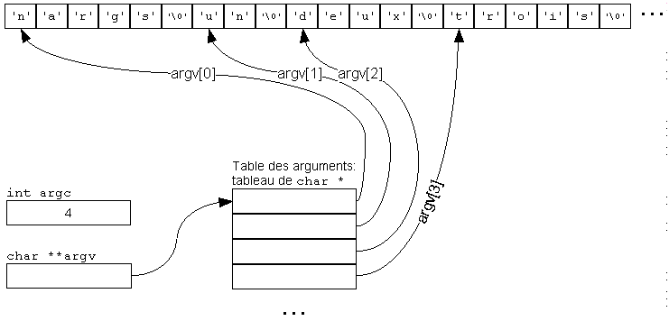
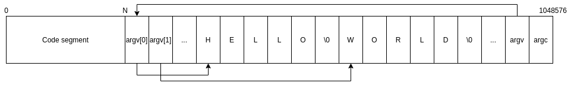

# Fenetre_OS

## Kernel
Nous avions comme sujet l'implémentation des arguments variable et code de retour.

Concernant les arguments variables, nous les avons implémenté et ils fonctionnent correctement.

Tout d'abord nous avons vu que les arguments variables (argv) sont un tableau de pointeur qui fonctionne de la manière suivante (voir figure ci-dessous):

On s'est d'abord dit que la manière la plus simple était de reproduire cette structure dans notre *task address space*. Au départ nous voulions "réserver" `MAX_ARG * 32 bits + ARG * 32 bits` (où *MAX_ARG* est le nombre d'argument maximale et *ARG* le nombre d'argument passé) au début de notre stack, mais on s'est vite rendu compte que c'était plus facile de les placer après le segment de code (notamment parce que le app.ld relocalise tout à partir de l'adresse **0x0**). Nous avons donc implémenté dans notre *exec* l'ajout de notre argv de la manière suivante (voir figure ci-dessous):

Concernant les codes de retour. Les codes quand une tâche se termine correctement ou échoue (exception) fonctionnent. Dans notre exec, nous retournons la valeur qui se trouve dans le `registre eax` de notre tâche courante. En cas d'erreur ou d'exception, le code de retour est `-1`

### Remerciements
Nous souhaitons remercier **Baptiste Coudray** qui nous a aidé à résoudre un bug lors de la partie avec les arguments variables. Nous avions oublié de soustraire l'adresse du `task_addr_space` à nos pointeurs des arguments variables afin de les ramener entre `0x0` et `0x100000`, ce qui nous provoquait une `General Protection Error`. (voir ligne **39** et **45** du fichier **kernel/task/exec.c**)

## User
Nous avons rajouter la commande **argv** qui permet d'afficher les arguments variables de la tâche.

Lorsqu'une application est exécutée depuis le shell, elle aura toujours comme premier argument son nom.

## Librairie
Nous avons ajouté quelques fonctionnalités dans nos librairie
- Dans la librairie string
    - Le split d'un string sur un char